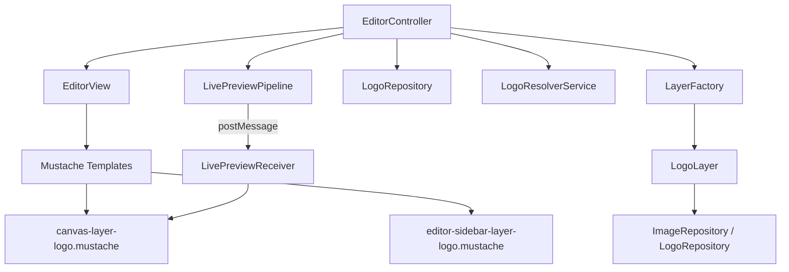

# Requirements

### Overview & Goals
Introduce a new **Logo Layer** type that allows users to place and manage logos on the canvas. Logos are managed as a separate category of assets, ingested from a dedicated presets folder. A key feature is **Logo Normalization**, which ensures that logo layers automatically resolve to the best available logo when templates are shared across different brand-specific instances of the app.

### Scope
- **In Scope**:
    - Creation of a new `LogoLayer` model.
    - Ingestion of logo assets from `presets/logo/logos.json`.
    - **Asset Migration**: Move existing logo assets from `presets/images/` to `presets/logo/`.
    - **Logo Mapping/Normalization**: Logic based on the naming convention `[theme]-[size]-[variation]`.
    - **Live Preview Sliders**: Width and Opacity adjustment with real-time feedback.
    - **Positioning**: Integration with the "slot" alignment system.
    - Dedicated "Logos" tab in the gallery.
    - Sidebar controls for `LogoLayer` including logo switching via thumbnails.
    - Re-ingestion setting for logos.
- **Out of Scope**:
    - Editing the logo image itself (cropping is handled via the existing `GalleryFlow` if enabled, but logos are usually used as-is).
    - Multi-logo selection for a single layer.
    - **Color Adjustment**: Logo colors are fixed and cannot be modified by the user.

### Functional Requirements
- Users can add a "Logo Layer" from the "Add Layer" modal.
- Logos are ingested from `/presets/logo/logos.json`.
- **Naming Convention**: Logos follow the pattern `[theme]-[size]-[variation]` (e.g., `light-large-01`, `dark-compact-02`).
- **Logo Auto-Resolution**: When a creation is opened, the app automatically maps requested logo IDs to the best available match in the current instance:
    1. Exact match.
    2. Same theme and size, highest available variation (e.g., requested `03` falls back to `02`).
    3. First available logo as a final fallback.
- Logos are excluded from "Images" and "Backgrounds" galleries.
- The editor sidebar for a Logo Layer shows a gallery of all ingested logos as cards with thumbnails.
- Clicking a logo card in the sidebar immediately updates the layer's image.
- **Alignment & Fine-Tuning**: Users can select a "slot" for positioning and use sliders to adjust width, opacity, and position (X/Y offset) with live preview.
- A "Rebuild Logo Repository" button is available in the Settings view.

# Technical Design

### Current Implementation
- Layers are managed by `LayerFactory` and follow a Model-View-Controller pattern.
- Images and backgrounds are stored in IndexedDB and served via `ImageUrlManager`.
- The editor sidebar uses Mustache templates and Form Adapters to map UI to models.
- The **Live Preview Pipeline** uses `postMessage` to send real-time updates (sliders, text) to the canvas iframe.

### Key Decisions
- **Separate Repository**: A dedicated `logoRepository` and `logos` IndexedDB store will be created to keep logos isolated from other assets, following the project's existing pattern for backgrounds and image presets.
- **LogoLayer inheritance**: `LogoLayer` will be implemented as a new layer type. While similar to `ImageLayer`, having a dedicated type allows for specific UI controls and logo auto-resolution.
- **No Color Adjustment**: To maintain brand consistency, `LogoLayer` will intentionally exclude the color adjustment filters (brightness, contrast, etc.) found in the standard `ImageLayer`.
- **LogoResolverService**: A dedicated service will handle the normalization logic. It will be used by the `EditorController` whenever a creation is loaded, ensuring a "fail-safe" experience where logos are always rendered even if the exact asset ID from the original template is missing.
- **Sidebar Selection**: The sidebar for `LogoLayer` will render a scrollable list of logo cards (reusing the `image-card` partial) to satisfy the requirement of "switching between logos using cards with thumbnails".
- **Live Preview Extension**: The `LivePreviewPipeline` and the canvas-side `LivePreviewReceiver` will be extended to support `src` (image URL), `width`, and `opacity` updates. This allows the canvas to reflect logo selection and adjustment immediately.

### Proposed Changes

#### Data Models & Repositories
- **Database**: Add `logos` store to `util/database.mjs`.
- **LogoRepository**: New repository in `repository/logo-repository.mjs`.
- **LogoLayer**: New model in `model/logo-layer.mjs`.
    - Properties: `logoId`, `slot`, `width`, `opacity`, `offsetX`, `offsetY`.
- **Creation**: Update constructor to support the `logo` layer type.

#### Services & Controllers
- **LogoResolverService**: New service in `service/logo-resolver-service.mjs`.
    - `resolveLogoId(requestedId, availableLogos)`: Implements the normalization/fallback logic by parsing the ID convention.
- **LogoIngestController**: New controller to handle the ingestion manifest from `/presets/logo/logos.json`.
- **LayerFactory**: Register the `logo` type.
- **ImageService**: Update to include `logoRepository` when fetching images.
- **GalleryFlow / GalleryController**: Add support for the `logos` tab and filter logic.
- **EditorController**:
    - Update `refresh()` to iterate over layers and call `LogoResolverService` for any `LogoLayer` when a creation is loaded.
    - If a logo is resolved to a different ID than requested, the creation is updated and saved.
    - Update `#bindEvents()` to handle selection of logo cards in the sidebar.
- **LogoLayerFormAdapter**: New adapter to handle form data for logo layers (extracting slot, width, opacity, etc.).
- **LivePreviewPipeline**: Update `sendUpdate` to support sending image source (`src`), width, and opacity updates to the canvas.
- **LivePreviewReceiver** (in `view/canvas-live-preview.js`): Update to handle the `src`, `width`, and `opacity` properties in `UPDATE_LAYER` messages.

#### UI & Templates
- **AddLayerModal**: Add "Logo Layer" card.
- **Editor Sidebar**: 
    - `editor-sidebar-layer-logo.mustache`: Contains a scrollable list of logos rendered as cards, a **Slot** selector, and sliders for **Width**, **Opacity**, and **Offsets**.
- **Canvas**:
    - `canvas-layer-logo.mustache`: Renders the selected logo in the iframe, following the slot/offset positioning.

### Architecture Diagram

### Risks & Pitfalls
- **Logo Visibility**: Logos are often white/light (for dark backgrounds) or dark (for light backgrounds). The cards in the sidebar should have a neutral or checkered background to ensure all logos are visible regardless of their color. Reusing `image-card.mustache` with a custom CSS class for logos is recommended.
- **ID Consistency**: If IDs in `logos.json` don't follow the `[theme]-[size]-[variation]` pattern, the `LogoResolverService` should gracefully fall back to the first available logo.
- **Z-Index Management**: Ensure that adding a new Logo Layer correctly calculates the next available z-index to avoid overlap issues.
- **Object URL Leaks**: Ensure `ImageUrlManager.revokeAll()` or `revokeExcept()` is called when switching between creations or leaving the editor to prevent memory leaks from many logo thumbnails.

# Delivery Steps

###   Step 1: Infrastructure: Database, Repository, and Model updates
Setup the foundation for logo assets and their storage.

- Add `logos` object store to `Database` in `util/database.mjs`.
- Create `repository/logo-repository.mjs` for managing preset logos.
- Register `logoRepository` in `Dependencies` in `util/dependencies.mjs`.
- Update `Image` model JSDoc to include `logo` category in `model/image.mjs`.
- Add `logos` -> `logo` normalization in `CategoryUtils` in `util/category-utils.mjs`.

###   Step 2: Asset Ingestion: Logo Ingest Controller and Settings
Implement the ingestion of logo assets from the presets repository.

- Create `presets/logo/` directory and move existing logo assets from `presets/images/`.
- Create `controller/logo-ingest-controller.mjs` to handle ingestion from `/presets/logo/logos.json`.
- Initialize and run `logoIngestController` in `main.mjs`.
- Add logo re-ingestion capability to `SettingsController` and `settings.mustache`.
- Update `ImageService.getImage` to search in the new `logoRepository`.

###   Step 3: Layer Logic and Resolver: LogoLayer, Creation, and Resolver Service
Create the Logo Layer model, update Creation support, and implement the logo resolver.

- Create `model/logo-layer.mjs` inheriting from `Layer` with `slot` and `logoId` properties.
- Create `service/logo-resolver-service.mjs` to implement the `[theme]-[size]-[variation]` fallback logic.
- Update `Creation` in `model/creation.mjs` to support the `logo` layer type in its constructor.
- Update `LayerFactory` in `service/layer-factory.mjs` to support the `logo` type.
- Add `logo` icon to `ICONS` in `globals/icons.mjs`.

###   Step 4: UI Components: AddLayerModal and Gallery updates
Update the gallery and adding layer modal to support logos.

- Update `AddLayerModal` view and template to include the "Logo Layer" option.
- Update `GalleryFlow` and `GalleryController` to include a "Logos" tab and handle logo assets.
- Ensure logos are filtered correctly (kept out of "Images" and "Backgrounds" tabs).
- Handle "Logo Layer" addition in `EditorController`.

###   Step 5: Editor: Sidebar controls and Canvas rendering
Implement the sidebar controls, canvas rendering, and auto-resolution logic.

- Create `LogoLayerFormAdapter` in `adapter/layer-form-adapters/logo-layer-form-adapter.mjs`.
- Create `view/templates/editor-sidebar-layer-logo.mustache` with a card-based logo selector and sliders for Width and Opacity.
- Create `view/templates/canvas-layer-logo.mustache` for rendering on the canvas.
- Update `view/canvas-live-preview.js` and `LivePreviewPipeline` to support image source (`src`), width, and opacity updates.
- Update `EditorView` to load these templates and provide logo data to the sidebar.
- Update `EditorController.refresh()` to auto-resolve logos in `LogoLayer`s using `LogoResolverService` during creation load.
- Bind selection events in `EditorController` to allow switching logos in the sidebar.
